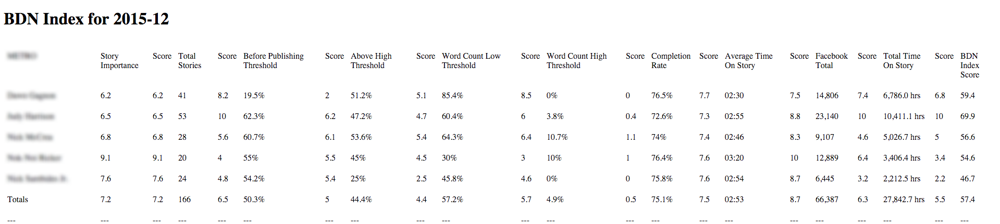

# BDN Index

The BDN Index is a monthly index that aggregates data about stories from WordPress, Google Analytics, Facebook.

## To install

- Make sure that the Google APIs Client Library for PHP is installed and in your include_path. [Here's how](https://developers.google.com/api-client-library/php/start/installation).

## Before you begin

- Make sure that the array in users.php correctly maps the user ids from WordPress to the correct names and desks.
-  
